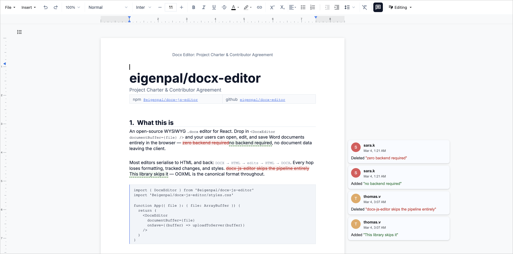

<p align="center">
  <a href="https://github.com/eigenpal/docx-js-editor">
    
  </a>
</p>

<p align="center">
  <a href="https://www.npmjs.com/package/@eigenpal/docx-js-editor"></a>
  <a href="https://www.npmjs.com/package/@eigenpal/docx-js-editor"></a>
  <a href="https://github.com/eigenpal/docx-js-editor/blob/main/LICENSE"></a>
  <a href="https://docx-js-editor.vercel.app/"></a>
</p>

# @eigenpal/docx-js-editor

Open-source WYSIWYG DOCX editor. Open, edit, and save `.docx` files entirely in the browser — no server required. [Try the live demo.](https://docx-js-editor.vercel.app/)

## Packages

This is a monorepo with three packages:

| Package                                      | Description                                                               | npm                                                                                                                                                        |
| -------------------------------------------- | ------------------------------------------------------------------------- | ---------------------------------------------------------------------------------------------------------------------------------------------------------- |
| [`@eigenpal/docx-core`](packages/core)       | Framework-agnostic core — DOCX parsing, ProseMirror schema, layout engine | [](https://www.npmjs.com/package/@eigenpal/docx-core)           |
| [`@eigenpal/docx-js-editor`](packages/react) | React UI — toolbar, paged editor, plugin host                             | [](https://www.npmjs.com/package/@eigenpal/docx-js-editor) |
| [`@eigenpal/docx-editor-vue`](packages/vue)  | Vue.js UI (scaffold — community contribution welcome)                     | —                                                                                                                                                          |

For most users, install `@eigenpal/docx-js-editor` — it includes everything. Use `@eigenpal/docx-core` directly for headless/server-side use or to build a custom UI in any framework.

<p align="center">
  <a href="https://docx-js-editor.vercel.app/">
    
  </a>
</p>

We built it for ourselves in [eigenpal.com](https://eigenpal.com) in order to have an editor for `.docx` files, which serve as AI document workflow output templates for our clients.

### Framework Examples

| Framework                                                                                                           | Example                                                                       |
| ------------------------------------------------------------------------------------------------------------------- | ----------------------------------------------------------------------------- |
|  Vite + React                                                     | [`examples/vite`](examples/vite) ([demo](https://docx-js-editor.vercel.app/)) |
|  Next.js | [`examples/nextjs`](examples/nextjs)                                          |
|  Remix                                                    | [`examples/remix`](examples/remix)                                            |
|  Astro                                                      | [`examples/astro`](examples/astro)                                            |
|  Vue.js (scaffold)                                               | [`examples/vue`](examples/vue)                                                |

## Installation

```bash
npm install @eigenpal/docx-js-editor
```

## Quick Start

```tsx
import { useRef } from 'react';
import { DocxEditor, type DocxEditorRef } from '@eigenpal/docx-js-editor';
import '@eigenpal/docx-js-editor/styles.css';

function Editor({ file }: { file: ArrayBuffer }) {
  const editorRef = useRef<DocxEditorRef>(null);

  const handleSave = async () => {
    const buffer = await editorRef.current?.save();
    if (buffer) {
      await fetch('/api/documents/1', { method: 'PUT', body: buffer });
    }
  };

  return (
    <>
      <button onClick={handleSave}>Save</button>
      <DocxEditor ref={editorRef} documentBuffer={file} onChange={() => {}} />
    </>
  );
}
```

> **Next.js / SSR:** The editor requires the DOM. Use a dynamic import or lazy `useEffect` load to avoid server-side rendering issues.

## Props

| Prop                   | Type                                        | Default           | Description                                       |
| ---------------------- | ------------------------------------------- | ----------------- | ------------------------------------------------- |
| `documentBuffer`       | `ArrayBuffer \| Uint8Array \| Blob \| File` | —                 | `.docx` file contents to load                     |
| `document`             | `Document`                                  | —                 | Pre-parsed document (alternative to buffer)       |
| `author`               | `string`                                    | `'User'`          | Author name for comments and track changes        |
| `readOnly`             | `boolean`                                   | `false`           | Read-only preview (hides toolbar, rulers, panel)  |
| `showToolbar`          | `boolean`                                   | `true`            | Show formatting toolbar                           |
| `showRuler`            | `boolean`                                   | `false`           | Show horizontal & vertical rulers                 |
| `rulerUnit`            | `'inch' \| 'cm'`                            | `'inch'`          | Unit for ruler display                            |
| `showZoomControl`      | `boolean`                                   | `true`            | Show zoom controls in toolbar                     |
| `showPrintButton`      | `boolean`                                   | `true`            | Show print button in toolbar                      |
| `showPageNumbers`      | `boolean`                                   | `true`            | Show page number indicator                        |
| `enablePageNavigation` | `boolean`                                   | `true`            | Enable interactive page navigation                |
| `pageNumberPosition`   | `string`                                    | `'bottom-center'` | Position of page number indicator                 |
| `showOutline`          | `boolean`                                   | `false`           | Show document outline sidebar (table of contents) |
| `showMarginGuides`     | `boolean`                                   | `false`           | Show page margin guide boundaries                 |
| `marginGuideColor`     | `string`                                    | `'#c0c0c0'`       | Color for margin guides                           |
| `initialZoom`          | `number`                                    | `1.0`             | Initial zoom level                                |
| `theme`                | `Theme \| null`                             | —                 | Theme for styling                                 |
| `toolbarExtra`         | `ReactNode`                                 | —                 | Custom toolbar items appended to the toolbar      |
| `placeholder`          | `ReactNode`                                 | —                 | Placeholder when no document is loaded            |
| `loadingIndicator`     | `ReactNode`                                 | —                 | Custom loading indicator                          |
| `className`            | `string`                                    | —                 | Additional CSS class name                         |
| `style`                | `CSSProperties`                             | —                 | Additional inline styles                          |
| `onChange`             | `(doc: Document) => void`                   | —                 | Called on document change                         |
| `onSave`               | `(buffer: ArrayBuffer) => void`             | —                 | Called on save                                    |
| `onError`              | `(error: Error) => void`                    | —                 | Called on error                                   |
| `onSelectionChange`    | `(state: SelectionState \| null) => void`   | —                 | Called on selection change                        |
| `onFontsLoaded`        | `() => void`                                | —                 | Called when fonts finish loading                  |
| `onPrint`              | `() => void`                                | —                 | Called when print is triggered                    |
| `onCopy`               | `() => void`                                | —                 | Called when content is copied                     |
| `onCut`                | `() => void`                                | —                 | Called when content is cut                        |
| `onPaste`              | `() => void`                                | —                 | Called when content is pasted                     |

## Ref Methods

```tsx
const ref = useRef<DocxEditorRef>(null);

await ref.current.save(); // Returns ArrayBuffer of the .docx
ref.current.getDocument(); // Current document object
ref.current.setZoom(1.5); // Set zoom to 150%
ref.current.focus(); // Focus the editor
ref.current.scrollToPage(3); // Scroll to page 3
ref.current.print(); // Print the document
```

## Read-Only Preview

Use `readOnly` for a preview-only viewer. This disables editing, caret, and selection UI.

```tsx
<DocxEditor documentBuffer={file} readOnly />
```

## Plugins

Extend the editor with the plugin system. Wrap `DocxEditor` in a `PluginHost` and pass plugins that can contribute ProseMirror plugins, side panels, document overlays, and custom CSS:

```tsx
import { DocxEditor, PluginHost, templatePlugin } from '@eigenpal/docx-js-editor';

function Editor({ file }: { file: ArrayBuffer }) {
  return (
    <PluginHost plugins={[templatePlugin]}>
      <DocxEditor documentBuffer={file} />
    </PluginHost>
  );
}
```

| Plugin                                                | Description                                                                                  |
| ----------------------------------------------------- | -------------------------------------------------------------------------------------------- |
| [Docxtemplater](packages/react/src/plugins/template/) | Syntax highlighting and annotation panel for [docxtemplater](https://docxtemplater.com) tags |

See [docs/PLUGINS.md](docs/PLUGINS.md) for the full plugin API, including how to create custom plugins with panels, overlays, and ProseMirror integrations.

## Features

- Full WYSIWYG editing with Microsoft Word fidelity
- **Track Changes (Suggestion Mode)** — edits become tracked insertions/deletions with author attribution, accept/reject per change or all at once
- **Comments & Replies** — add comments anchored to text selections, reply threads, resolve/reopen, sidebar with scroll-to-highlight
- Text and paragraph formatting (bold, italic, fonts, colors, alignment, spacing)
- Tables, images, hyperlinks
- Extensible plugin architecture
- Undo/redo, find & replace, keyboard shortcuts
- Print preview
- Zero server dependencies

### Track Changes

Toggle **Suggestion Mode** from the toolbar (or `Ctrl+Shift+E`) to enter tracked editing. While active:

- Typed text is marked as an **insertion** (green underline)
- Deleted text is NOT removed — it's marked as a **deletion** (red strikethrough)
- Each change is attributed to the `author` prop and timestamped
- Consecutive edits by the same author are grouped into a single change
- Own insertions can be retracted (backspace removes them instead of marking as deletion)

Accept or reject individual changes from the sidebar, or accept/reject all at once.

### Comments

Click the comment button (or select text and press `Ctrl+Alt+M`) to add a comment anchored to a text range. Comments appear in the sidebar with:

- Author name and timestamp
- Reply threads
- Resolve / reopen actions
- Click-to-scroll: clicking a comment scrolls to and highlights the anchored text

## Development

```bash
bun install
bun run dev          # Vite + React example on localhost:5173
bun run dev:nextjs   # Next.js example on localhost:3000
bun run dev:remix    # Remix example on localhost:3001
bun run dev:astro    # Astro example on localhost:4321
```

### Monorepo Structure

```
packages/
  core/     — @eigenpal/docx-core (DOCX parsing, ProseMirror, layout engine)
  react/    — @eigenpal/docx-js-editor (React components, toolbar, plugins)
  vue/      — @eigenpal/docx-editor-vue (scaffold for Vue.js integration)
examples/
  vite/     — Vite + React demo app
  vue/      — Vue.js demo app (scaffold)
  nextjs/   — Next.js example
  remix/    — Remix example
  astro/    — Astro example
```

### Building

```bash
bun run build        # Build core first, then react
bun run typecheck    # Typecheck all packages
```

Each example is independently deployable. Copy any `examples/<framework>/` directory to start your own project — just `npm install` and go.

## License

MIT
